# icpc-logos

## Usage

Download the logos and the `organizations.json` from the releases.
For DOMJudge use the `background_64.zip`.

## Contribution

- Add a organization by duplicating one of the existing logos, and change the content of the logos group.
  - It is important the logos group still exists, and contains the logo.
- Add the organization to `organizations.json`.
  - As `id`, use the ICPC id, starting with a `U-`.
  - For companies, just pick the next free one starting with a `C-`.
- Test the export by running `./export.sh`.
  - Inkscape should be installed for this.

## List of logos

| Logo | ICPC ID | Name | Status |
|---|---|---|---|
|  | U-7250 |  Radboud University | :heavy_check_mark: |
|  | U-1180 |  Linköping University | :heavy_check_mark: |
| 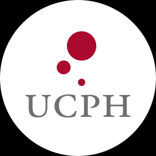 | U-2145 |  University of Copenhagen | :heavy_check_mark: |
|  | U-3316 |  Imperial College London | :heavy_check_mark: |
| 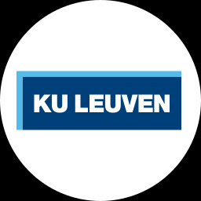 | U-3179 |  Katholieke Universiteit Leuven | :heavy_check_mark: |
| 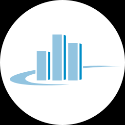 | U-18628 |  Frankfurt am Main University of Applied Sciences | :heavy_check_mark: |
|  | U-5077 |  University of Bath | :heavy_check_mark: |
|  | U-0798 |  Friedrich-Alexander-University Erlangen-Nuremberg | :heavy_check_mark: |
| 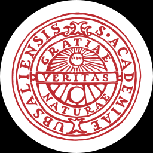 | U-2338 |  Uppsala University | :heavy_check_mark: |
| 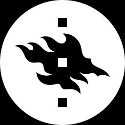 | U-2986 |  University of Helsinki | :heavy_check_mark: |
|  | U-0016 |  Aarhus University | :heavy_check_mark: |
| 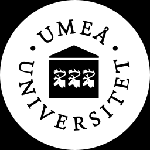 | U-1936 |  Umeå University | :heavy_check_mark: |
|  | U-0635 |  Delft University of Technology | :heavy_check_mark: |
|  | U-18717 |  Universitaet des Saarlandes | :heavy_check_mark: |
|  | U-3386 |  University of Nottingham | :heavy_check_mark: |
| 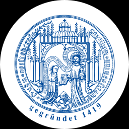 | U-2088 |  Universität Rostock | :heavy_check_mark: |
|  | U-6062 |  University of Liverpool | :heavy_check_mark: |
|  | U-3088 |  Avans Hogeschool's - Hertogenbosch | :heavy_check_mark: |
| 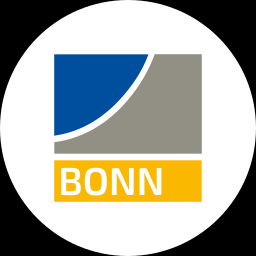 | U-0471 |  Bonn University | :heavy_check_mark: |
|  | U-1393 |  Norwegian University of Science and Technology | :heavy_check_mark: |
| 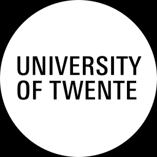 | U-2307 |  University of Twente | :heavy_check_mark: |
|  | U-2381 |  Vrije Universiteit | :heavy_check_mark: |
| 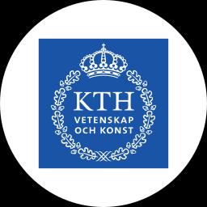 | U-1133 |  KTH - Royal Institute of Technology | :heavy_check_mark: |
|  | U-0676 |  Dublin City University | :heavy_check_mark: |
|  | U-18720 |  University of Bergen | :heavy_check_mark: |
|  | U-0998 |  Jacobs University | :heavy_check_mark: |
| 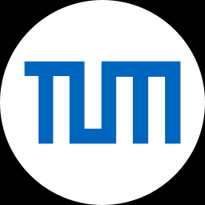 | U-1833 |  Technische Universität München | :heavy_check_mark: |
|  | U-2086 |  Karlsruhe Institute of Technology | :heavy_check_mark: |
|  | U-5267 |  University of Manchester | :heavy_check_mark: |
|  | U-5313 |  University of Edinburgh | :heavy_check_mark: |
|  | U-1172 |  Leiden University | :heavy_check_mark: |
|  | U-3264 |  University of Oxford | :heavy_check_mark: |
|  | U-0001 |  Lappeenranta University of Technology | :heavy_check_mark: |
| 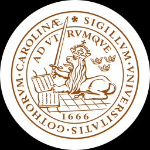 | U-1192 |  Lund University | :heavy_check_mark: |
|  | U-6175 |  University of Warwick | :heavy_check_mark: |
| 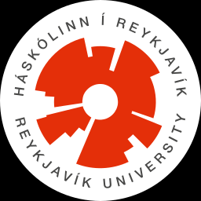 | U-3052 |  Reykjavik University | :heavy_check_mark: |
|  | U-2233 |  University of Oslo | :heavy_check_mark: |
|  | U-4257 |  Johannes Gutenberg Universität Mainz | :heavy_check_mark: |
| 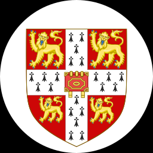 | U-2134 |  University of Cambridge | :question: |
|  | U-6104 |  University of Southampton | :heavy_check_mark: |
|  | U-0711 |  Eindhoven University of Technology | :heavy_check_mark: |
|  | U-19555 |  Université Catholique de Louvain | :heavy_check_mark: |
|  | U-3317 |  University College Dublin | :question: |
|  | U-2096 |  Universiteit Utrecht | :question: |
|  | U-6253 |  University College London | :heavy_check_mark: |
|  | U-1227 |  Universität zu Lübeck | :heavy_check_mark: |

### Legend

| Status | description |
|---|---|
| :x: | Missing |
| :question: | Present, but needs verification |
| :heavy_check_mark: | Verified
