# icpc-logos

## Usage

Download the logos and the `organizations.json` from the releases.
For DOMJudge use the `background_64.zip`.

## Contribution

### University
- Add a university by duplicating one of the existing logos in `universities/logos`, and change the content of the logos group.
  - It is important the logos group still exists, and contains the logo.
  - The logo might already be in the `no_orginazations_yet` directory. Look there first.
- Add the organization to `universities/organizations.json`.
  - As `id`, use the ICPC id, starting with a `U-`.
- Test the export by running `./export.sh`.
  - Inkscape should be installed for this.

### Company
- Add a company by duplicating one of the existing logos in `companies/logos`, and change the content of the logos group.
  - It is important the logos group still exists, and contains the logo.
  - The logo might already be in the `no_orginazations_yet` directory. Look there first.
- Add the organization to `company/organizations.json`.
  - As `id`, use the next free id, starting with a `C-`.
- Test the export by running `./export.sh`.
  - Inkscape should be installed for this.

### Study
- Add a new study combination by adding it to `studies/organizations.json`
  - As `id`, use the next free id, starting with an `S-`.
- Add a new study by getting an svg icon from [materialdesignicons.com](https://materialdesignicons.com)
  - Put it in `studies/logos`.
  - Add the study to `studies/organizations.json`.
- Test the export by running `./export.sh`.
  - Inkscape should be installed for this.

### Other
- Add a other logo by duplicating one of the existing logos in `others/logos`, and change the content of the logos group.
- It is important the logos group still exists, and contains the logo.
- Add the organization to `others/organizations.json`.
- As `id`, use the next free id, starting with a `O-`.
- Test the export by running `./export.sh`.
- Inkscape should be installed for this.

## List of logos

### Legend

| Status | description |
|---|---|
| :x: | Missing |
| :question: | Present, but needs verification |
| :heavy_check_mark: | Verified

### Universities

| Logo | ICPC ID | Name | Status |
|---|---|---|---|
|  | 7 |  Aarhus University | :heavy_check_mark: |
|  | 33 |  Ulm University | :heavy_check_mark: |
| 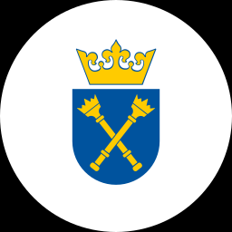 | 131 |  Jagiellonian University in Krakow | :heavy_check_mark: |
| 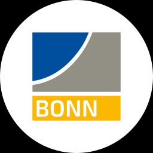 | 175 |  Bonn University | :heavy_check_mark: |
|  | 290 |  Christian-Albrechts-Universitaet zu Kiel | :heavy_check_mark: |
| 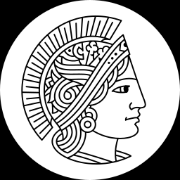 | 362 |  Darmstadt University of Technology | :heavy_check_mark: |
|  | 367 |  Delft University of Technology | :heavy_check_mark: |
|  | 452 |  Eindhoven University of Technology | :heavy_check_mark: |
|  | 573 |  Friedrich-Alexander-University Erlangen-Nuremberg | :heavy_check_mark: |
|  | 980 |  Kaunas University of Technology | :heavy_check_mark: |
| 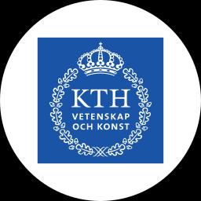 | 1039 |  KTH - Royal Institute of Technology | :heavy_check_mark: |
|  | 1088 |  Leiden University | :heavy_check_mark: |
| 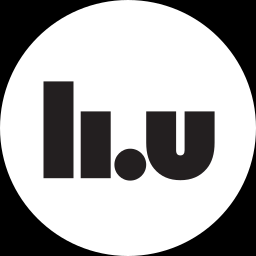 | 1097 |  Linköping University | :heavy_check_mark: |
| 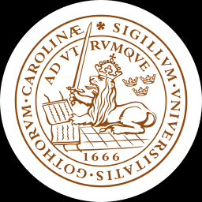 | 1112 |  Lund University | :heavy_check_mark: |
|  | 1154 |  Universität zu Lübeck | :heavy_check_mark: |
|  | 1362 |  Norwegian University of Science and Technology | :heavy_check_mark: |
| 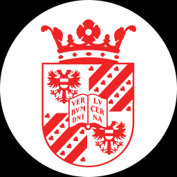 | 1534 |  Rijksuniversiteit Groningen | :heavy_check_mark: |
| 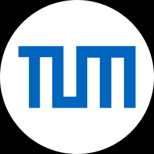 | 1917 |  Technische Universität München | :heavy_check_mark: |
|  | 2061 |  Umeå University | :heavy_check_mark: |
|  | 2267 |  Saarland University | :heavy_check_mark: |
|  | 2272 |  Karlsruhe Institute of Technology | :heavy_check_mark: |
| 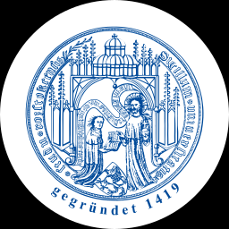 | 2274 |  Universität Rostock | :heavy_check_mark: |
|  | 2275 |  Universität Ulm | :heavy_check_mark: |
|  | 2282 |  Leiden University | :heavy_check_mark: |
| 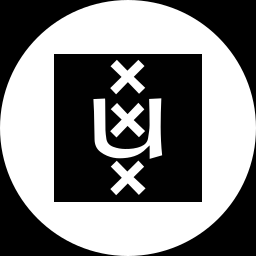 | 2284 |  Universiteit van Amsterdam | :heavy_check_mark: |
| 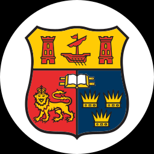 | 2292 |  University College Cork | :heavy_check_mark: |
|  | 2320 |  University of Bergen | :heavy_check_mark: |
| 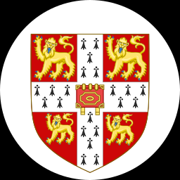 | 2343 |  University of Cambridge | :heavy_check_mark: |
| 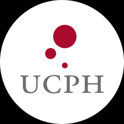 | 2357 |  University of Copenhagen | :heavy_check_mark: |
| 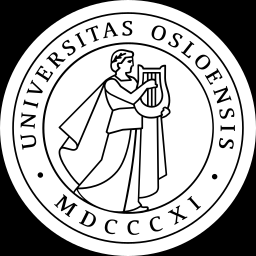 | 2467 |  University of Oslo | :heavy_check_mark: |
|  | 2523 |  University of Sussex | :heavy_check_mark: |
|  | 2526 |  University of Tartu | :heavy_check_mark: |
| 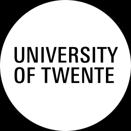 | 2561 |  University of Twente | :heavy_check_mark: |
| 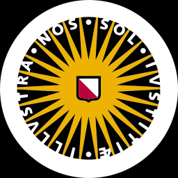 | 2625 |  Utrecht University | :heavy_check_mark: |
|  | 2643 |  Vilnius University | :heavy_check_mark: |
|  | 2664 |  Vrije Universiteit | :heavy_check_mark: |
| 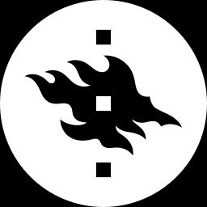 | 3330 |  University of Helsinki | :heavy_check_mark: |
| 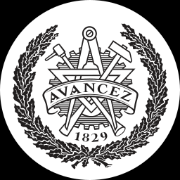 | 3397 |  Chalmers University of Technology | :heavy_check_mark: |
| 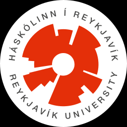 | 3403 |  Reykjavik University | :heavy_check_mark: |
|  | 3546 |  Ghent University | :heavy_check_mark: |
|  | 3620 |  University of Oxford | :heavy_check_mark: |
| 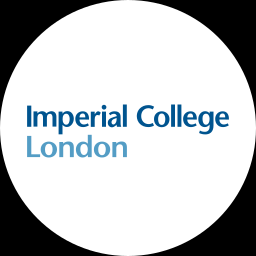 | 3678 |  Imperial College London | :heavy_check_mark: |
|  | 3749 |  University of Nottingham | :heavy_check_mark: |
|  | 3758 |  King's College London | :heavy_check_mark: |
| 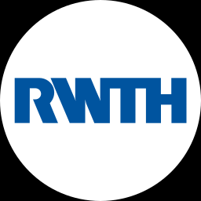 | 3787 |  RWTH Aachen University | :heavy_check_mark: |
| 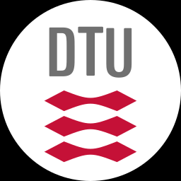 | 4278 |  Technical University of Denmark | :heavy_check_mark: |
|  | 4711 |  Johannes Gutenberg Universität Mainz | :heavy_check_mark: |
|  | 4786 |  Aalto University | :heavy_check_mark: |
| 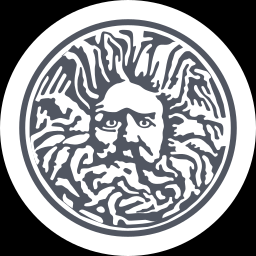 | 5541 |  University of Bath | :heavy_check_mark: |
| 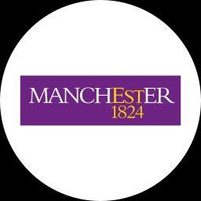 | 5737 |  University of Manchester | :heavy_check_mark: |
|  | 5784 |  University of Edinburgh | :heavy_check_mark: |
|  | 6026 |  Molde University College | :heavy_check_mark: |
| 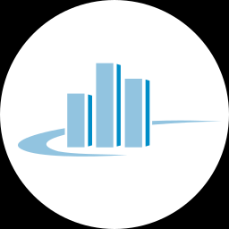 | 6557 |  Frankfurt University of Applied Sciences | :heavy_check_mark: |
| 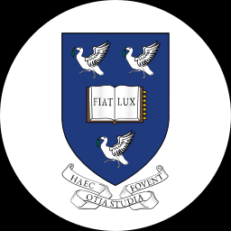 | 6817 |  University of Liverpool | :heavy_check_mark: |
| 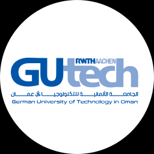 | 6638 |  German University of Technology in Oman | :heavy_check_mark: |
|  | 6859 |  University of Southampton | :heavy_check_mark: |
|  | 6864 |  IT University of Copenhagen | :heavy_check_mark: |
|  | 6929 |  University of Warwick | :heavy_check_mark: |
|  | 6940 |  University of Glasgow | :heavy_check_mark: |
| 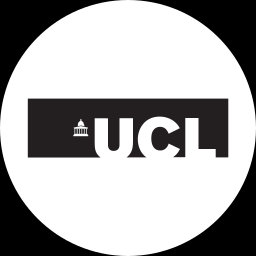 | 7006 |  University College London | :heavy_check_mark: |
| 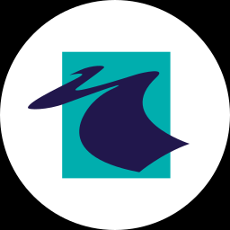 | 7019 |  Hogeschool Leiden | :heavy_check_mark: |
| 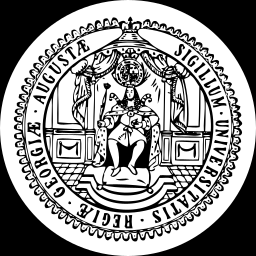 | 7264 |  University of Göttingen | :heavy_check_mark: |
|  | 7431 |  Aalborg University | :heavy_check_mark: |
|  | 7464 |  Brunel University London | :heavy_check_mark: |
|  | 7477 |  Vilnius Gediminas Technical University | :heavy_check_mark: |
| 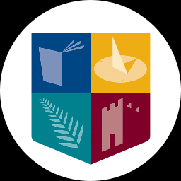 | 7488 |  Maynooth University | :heavy_check_mark: |
|  | 7887 |  University of Iceland | :heavy_check_mark: |
| 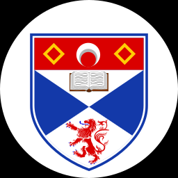 | 7918 |  University of St Andrews | :heavy_check_mark: |
|  | 7950 |  University of Birmingham | :heavy_check_mark: |
|  | 8002 |  Radboud University | :heavy_check_mark: |
| 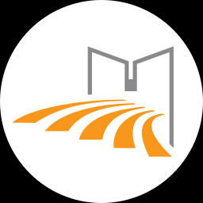 | 8102 |  University of Passau | :heavy_check_mark: |
| 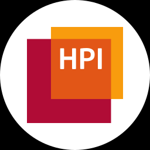 | 8170 |  Hasso Plattner Institute | :heavy_check_mark: |
|  | 8311 |  Université de Mons | :heavy_check_mark: |
|  | 8317 |  University of Bristol | :heavy_check_mark: |
|  | 9858 |  Université Catholique de Louvain | :heavy_check_mark: |
|  | 10500 |  Maastricht University | :heavy_check_mark: |
|  | 11054 |  Tallinn University of Technology | :heavy_check_mark: |
| 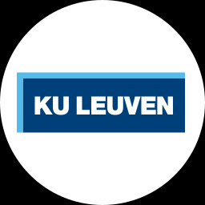 | 11103 |  KU Leuven | :heavy_check_mark: |
|  | 11352 |  Ruhr University Bochum | :heavy_check_mark: |
|  | 13859 |  University of Luxembourg | :heavy_check_mark: |
|  | 14148 |  University of Leeds | :heavy_check_mark: |
|  | 14277 |  Hochschule für angewandte Wissenschaften Würzburg-Schweinfurt | :heavy_check_mark: |
|  | 18106 |  Jacobs University in Bremen | :heavy_check_mark: |
| 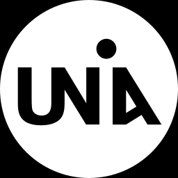 | 18633 |  University of Augsburg | :heavy_check_mark: |
|  | 20052 |  Heinrich-Heine-Universität Düsseldorf | :heavy_check_mark: |
| 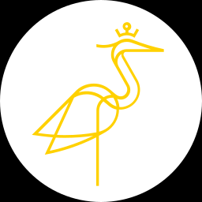 | 21966 |  Anglia Ruskin University | :heavy_check_mark: |
| 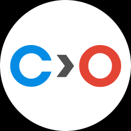 | 21967 |  Constructor University Bremen | :heavy_check_mark: |
|  | 23885 |  Jönköping University | :heavy_check_mark: |
| 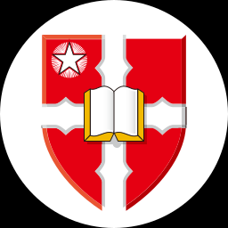 | 26092 |  Liverpool Hope University | :heavy_check_mark: |

### Companies

| Logo | ID | Name | Status |
|---|---|---|---|
|  | C-2 |  ASML | :heavy_check_mark: |
|  | C-3 |  BetterBe B.V. | :heavy_check_mark: |
|  | C-4 |  Booking.com | :heavy_check_mark: |
|  | C-5 |  Centrum Wiskunde & Informatica | :heavy_check_mark: |
|  | C-6 |  Dassault Systèmes | :heavy_check_mark: |
|  | C-7 |  IMC Trading B.V. | :heavy_check_mark: |
|  | C-8 |  Ortec International B.V. | :heavy_check_mark: |
|  | C-10 |  Sioux Technologies B.V. | :heavy_check_mark: |
|  | C-11 |  bol.com | :heavy_check_mark: |
|  | C-12 |  OrangeMason B.V. | :heavy_check_mark: |
|  | C-13 |  Picnic | :heavy_check_mark: |
|  | C-14 |  ING | :heavy_check_mark: |
|  | C-15 |  Flow Traders | :heavy_check_mark: |
|  | C-16 |  Prodrive Technologies | :heavy_check_mark: |
|  | C-17 |  Quintiq | :heavy_check_mark: |
|  | C-18 |  OVSoftware | :heavy_check_mark: |
|  | C-19 |  Jane Street Capital | :heavy_check_mark: |
|  | C-20 |  Fox-IT | :heavy_check_mark: |
|  | C-21 |  Huawei | :heavy_check_mark: |
|  | C-22 |  Netcompany | :heavy_check_mark: |
|  | C-23 |  JetBrains | :heavy_check_mark: |
|  | C-24 |  International Collegiate Programming Contest | :heavy_check_mark: |
|  | C-25 |  Jump Trading | :heavy_check_mark: |

### Studies

| Icon 1 | Icon 2 | Icon 3 | Icon 4 | ID | Name | Status |
|---|---|---|---|---|---|---|
|  |   |   |   | S-1 |  Computer Science & Engineering | :heavy_check_mark: |
|  |  |   |   | S-2 |  Computer Science & Eng. + Nanobiology | :heavy_check_mark: |
|  |  |   |   | S-3 |  Computer Science & Eng. + A. Mathematics | :heavy_check_mark: |
|  |   |   |   | S-4 |  Applied Mathematics | :heavy_check_mark: |
|  |  |  |   | S-5 |  A. Mathematics + Mechanical Eng. + Aerospace Eng. | :heavy_check_mark: |
|  |   |   |   | S-6 |  Electrical Engineering | :heavy_check_mark: |
|  |   |   |   | S-7 |  Nanobiology | :heavy_check_mark: |
|  |  |   |   | S-8 |  Computer Science & Eng. + Aerospace Eng. | :heavy_check_mark: |
|  |  |  |  | S-9 |  CSE + A. Mathematics + A. Physics + Aerospace Eng. | :heavy_check_mark: |
|  |  |  |   | S-10 |  CSE + A. Mathematics + A. Physics | :heavy_check_mark: |

### Others

| Logo | ID | Name | Status |
|---|---|---|---|
| 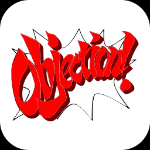 | O-1 |  OBJECTION! | :heavy_check_mark: |
|  | O-2 |  The Wise Owl | :heavy_check_mark: |
| 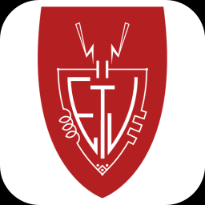 | O-3 |  Elektrichiens Vakbond | :heavy_check_mark: |
