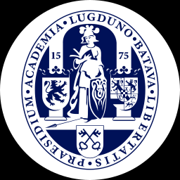

# icpc-logos

## Usage

Download the logos and the `organizations.json` from the releases.
For DOMJudge use the `background_64.zip`.

## Contribution

### University
- Add a university by duplicating one of the existing logos in `universities/logos`, and change the content of the logos group.
  - It is important the logos group still exists, and contains the logo.
  - The logo might already be in the `no_orginazations_yet` directory. Look there first.
- Add the organization to `universities/organizations.json`.
  - As `id`, use the ICPC id, starting with a `U-`.
- Test the export by running `./export.sh`.
  - Inkscape should be installed for this.

### Company
- Add a company by duplicating one of the existing logos in `companies/logos`, and change the content of the logos group.
  - It is important the logos group still exists, and contains the logo.
  - The logo might already be in the `no_orginazations_yet` directory. Look there first.
- Add the organization to `company/organizations.json`.
  - As `id`, use the next free id, starting with a `C-`.
- Test the export by running `./export.sh`.
  - Inkscape should be installed for this.

### Study
- Add a new study combination by adding it to `studies/organizations.json`
  - As `id`, use the next free id, starting with an `S-`.
- Add a new study by getting an svg icon from [materialdesignicons.com](https://materialdesignicons.com)
  - Put it in `studies/logos`.
  - Add the study to `studies/organizations.json`.
- Test the export by running `./export.sh`.
  - Inkscape should be installed for this.

## List of logos

### Legend

| Status | description |
|---|---|
| :x: | Missing |
| :question: | Present, but needs verification |
| :heavy_check_mark: | Verified |

### Universities

| Logo | ICPC ID | Name | Status |
|---|---|---|---|
|  | U-1 |  Lappeenranta University of Technology | :heavy_check_mark: |
|  | U-16 |  Aarhus University | :heavy_check_mark: |
|  | U-471 |  Bonn University | :heavy_check_mark: |
|  | U-635 |  Delft University of Technology | :heavy_check_mark: |
|  | U-676 |  Dublin City University | :heavy_check_mark: |
|  | U-711 |  Eindhoven University of Technology | :heavy_check_mark: |
|  | U-798 |  Friedrich-Alexander-University Erlangen-Nuremberg | :heavy_check_mark: |
|  | U-998 |  Jacobs University | :heavy_check_mark: |
|  | U-1133 |  KTH - Royal Institute of Technology | :heavy_check_mark: |
|  | U-1172 |  Leiden University | :heavy_check_mark: |
|  | U-1180 |  Linköping University | :heavy_check_mark: |
|  | U-1192 |  Lund University | :heavy_check_mark: |
|  | U-1227 |  Universität zu Lübeck | :heavy_check_mark: |
|  | U-1393 |  Norwegian University of Science and Technology | :heavy_check_mark: |
|  | U-1833 |  Technische Universität München | :heavy_check_mark: |
|  | U-1936 |  Umeå University | :heavy_check_mark: |
|  | U-2086 |  Karlsruhe Institute of Technology | :heavy_check_mark: |
|  | U-2088 |  Universität Rostock | :heavy_check_mark: |
|  | U-2096 |  Universiteit Utrecht | :heavy_check_mark: |
|  | U-2134 |  University of Cambridge | :heavy_check_mark: |
|  | U-2145 |  University of Copenhagen | :heavy_check_mark: |
|  | U-2233 |  University of Oslo | :heavy_check_mark: |
|  | U-2307 |  University of Twente | :heavy_check_mark: |
|  | U-2338 |  Uppsala University | :heavy_check_mark: |
|  | U-2381 |  Vrije Universiteit | :heavy_check_mark: |
|  | U-2986 |  University of Helsinki | :heavy_check_mark: |
|  | U-3052 |  Reykjavik University | :heavy_check_mark: |
|  | U-3088 |  Avans Hogeschool's - Hertogenbosch | :heavy_check_mark: |
|  | U-3179 |  Katholieke Universiteit Leuven | :heavy_check_mark: |
|  | U-3264 |  University of Oxford | :heavy_check_mark: |
|  | U-3316 |  Imperial College London | :heavy_check_mark: |
|  | U-3317 |  University College Dublin | :heavy_check_mark: |
|  | U-3386 |  University of Nottingham | :heavy_check_mark: |
|  | U-4257 |  Johannes Gutenberg Universität Mainz | :heavy_check_mark: |
|  | U-5077 |  University of Bath | :heavy_check_mark: |
|  | U-5267 |  University of Manchester | :heavy_check_mark: |
|  | U-5313 |  University of Edinburgh | :heavy_check_mark: |
|  | U-6062 |  University of Liverpool | :heavy_check_mark: |
|  | U-6104 |  University of Southampton | :heavy_check_mark: |
|  | U-6175 |  University of Warwick | :heavy_check_mark: |
|  | U-6253 |  University College London | :heavy_check_mark: |
|  | U-7250 |  Radboud University | :heavy_check_mark: |
|  | U-18628 |  Frankfurt am Main University of Applied Sciences | :heavy_check_mark: |
|  | U-18717 |  Universitaet des Saarlandes | :heavy_check_mark: |
|  | U-18720 |  University of Bergen | :heavy_check_mark: |
|  | U-19555 |  Université Catholique de Louvain | :heavy_check_mark: |

### Companies

| Logo | ID | Name | Status |
|---|---|---|---|
|  | C-2 |  ASML | :heavy_check_mark: |
|  | C-3 |  BetterBe B.V. | :heavy_check_mark: |
|  | C-4 |  Booking.com | :heavy_check_mark: |
|  | C-5 |  Centrum Wiskunde & Informatica | :heavy_check_mark: |
|  | C-6 |  Dassault Systèmes | :heavy_check_mark: |
|  | C-7 |  IMC Trading B.V. | :heavy_check_mark: |
|  | C-8 |  Ortec International B.V. | :heavy_check_mark: |
|  | C-10 |  Sioux Technologies B.V. | :heavy_check_mark: |
|  | C-11 |  bol.com | :heavy_check_mark: |
|  | C-12 |  OrangeMason B.V. | :heavy_check_mark: |
|  | C-13 |  Picnic | :heavy_check_mark: |
|  | C-14 |  ING | :heavy_check_mark: |
|  | C-15 |  Flow Traders | :heavy_check_mark: |
|  | C-16 |  Prodrive Technologies | :heavy_check_mark: |
|  | C-17 |  Quintiq | :heavy_check_mark: |
|  | C-18 |  OVSoftware | :heavy_check_mark: |

### Studies

| Icon 1 | Icon 2 | Icon 3 | ID | Name | Status |
|---|---|---|---|---|---|
|  |   |   | S-1 |  Computer Science & Engineering | :heavy_check_mark: |
|  |  |   | S-2 |  Computer Science & Engineering + Nanobiology | :heavy_check_mark: |
|  |  |   | S-3 |  Computer Science & Engineering + Applied Mathematics | :heavy_check_mark: |
|  |   |   | S-4 |  Applied Mathematics | :heavy_check_mark: |
|  |  |  | S-5 |  Applied Mathematics + Mechanical Engineering + Aerospace Engineering | :heavy_check_mark: |
|  |   |   | S-6 |  Electrical Engineering | :heavy_check_mark: |